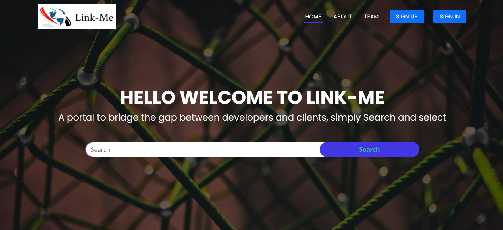
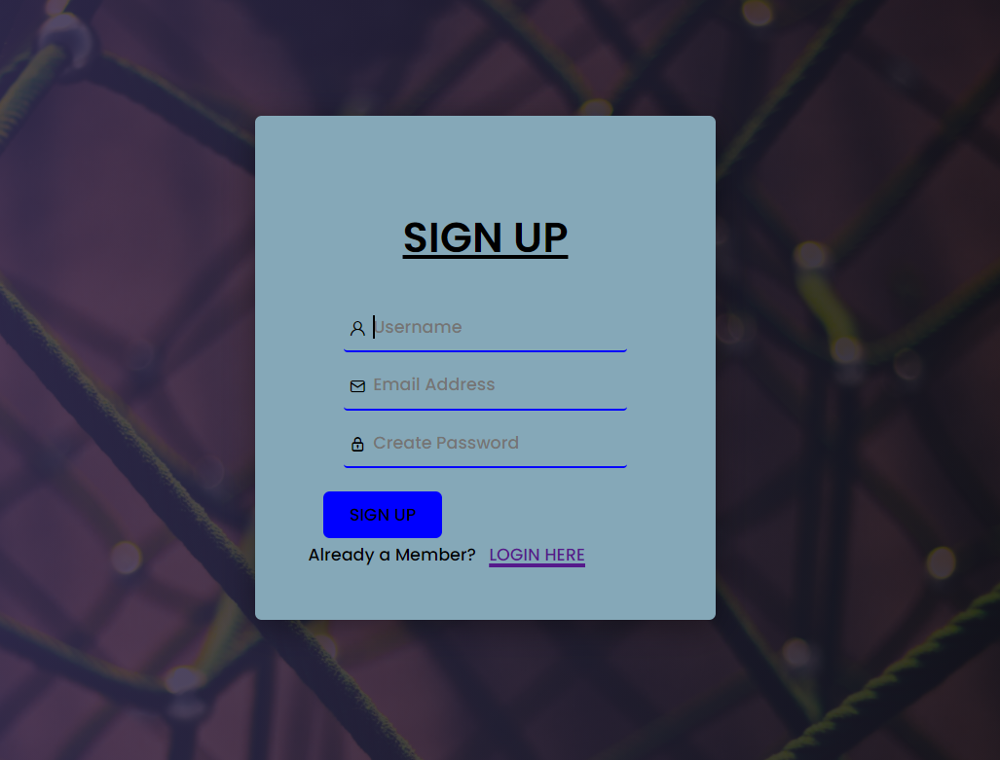
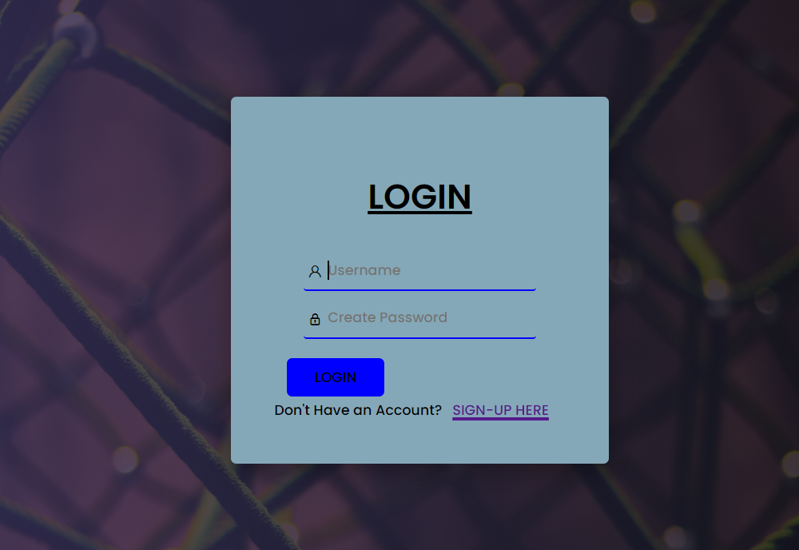
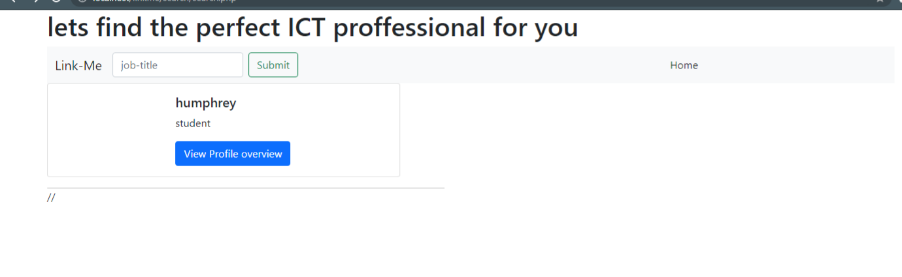

# ZETECH UNIVERSITY

## ICT Department

This repesitory is for the last project of DIPLOMA IN  SOFWARE ENGINEERING Course work. Collaborated by 4 members Omar moh'dNoor (Spokesperson), Kiplangat Edwin(Process Analyst), Humprey Kamau Njeri(Quality Control) and Kelvin Birech(Team Leader) towards DEVELOPMENT OF AN ONLINE ICT ACCES SYSTEM BASED ON KENYA

&nbsp;

## Computer Systems Project

## Sofware Requirement Specification

&nbsp;  

### DSE-01-0015/2020 Kiplangat Edwin

### DSE-01-0010/2020 Omar moh’d noor

### DSE-01-0158/2019 Kelvin Birech

### DSE-01-1617/2020 Humphrey Njeri Kamau

&nbsp;  

- [ZETECH UNIVERSITY](#zetech-university)
  - [ICT Department](#ict-department)
  - [Computer Systems Project](#computer-systems-project)
  - [Sofware Requirement Specification](#sofware-requirement-specification)
    - [DSE-01-0015/2020 Kiplangat Edwin](#dse-01-00152020-kiplangat-edwin)
    - [DSE-01-0010/2020 Omar moh’d noor](#dse-01-00102020-omar-mohd-noor)
    - [DSE-01-0158/2019 Kelvin Birech](#dse-01-01582019-kelvin-birech)
    - [DSE-01-1617/2020 Humphrey Njeri Kamau](#dse-01-16172020-humphrey-njeri-kamau)
  - [Introductuion](#introductuion)
  - [Objectives](#objectives)
  - [The Users Of The System](#the-users-of-the-system)
    - [Skilled IT guys](#skilled-it-guys)
    - [Employers](#employers)
  - [Functional Requirements](#functional-requirements)
    - [Creating User Accounts](#creating-user-accounts)
    - [Login](#login)
    - [Profile editing](#profile-editing)
    - [logout](#logout)
    - [Password Reset](#password-reset)
  - [Software Design Description](#software-design-description)
    - [HomePage](#homepage)
    - [Login+Register Page](#loginregister-page)

## Introductuion

This is a group project aimed towards the development of an online ICT service access system for easy access of ICT services from ICT proffesionals.
This system will quench the high demand of ICT services by connecting employers with their employees of choice.

## Objectives

The objectives of this project is to allow the new employees seeking or quenching their unemployment thirst to their respective employers.

## The Users Of The System

### Skilled IT guys

    This are people who are skilled in IT and they will be able to create their profiles and try to find any employer intrested in whatever field they are good at.

### Employers

    This are the people who will be looking for experienced IT persons to hire and fulfill tasks that meets their criteria.

## Functional Requirements

### Creating User Accounts

        a)A user who is new to the system will be presented with a screen where they will be able to sign up

### Login

       a) provides the user with text fields where they are asked to enter their username or password if they are already registered users of the system.
       b) if the username and the password is correct,the user will be directed to the homepage or dashboard of the system.
       C) if the password or the username is incorrect,the user will be asked to enter correct credentials.

### Profile editing

users will be able to view their profiles from this page and be allowed to make changes

### logout

    this option will allow to users to log out of the system

### Password Reset

this will allow users to change their password and reset if forgotten

&nbsp;

## Software Design Description

It contains images of how the system look

### HomePage

### Login+Register Page

1. Register
 
1. Login

search page

